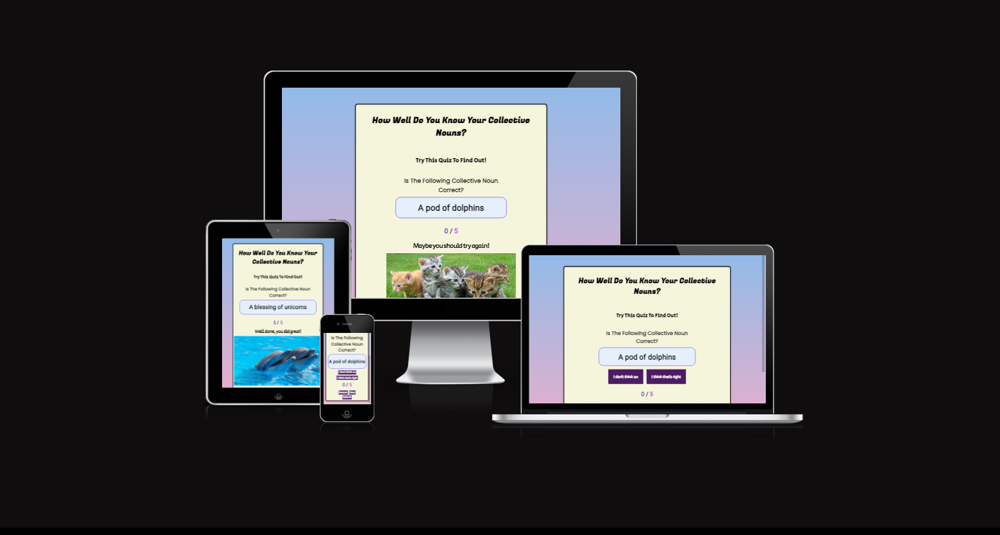

# PP2-Collective-Nouns-Quiz
A fun, educational quiz based on collective nouns of the English language

## The Collective Nouns Quiz
### Aim of this Quiz

Collective nouns are names given to groups of things, people, birds and animals.
They are a fun part of the English language, with many of them being funny or unusual, such as a 'crash' of rhinoceroses, or a 'horde' of hamsters.
The Collective Noun Quiz is easy enough for children and adults alike to navigate and have fun while learning.

### Responsive Mockup of The Collective Noun Quiz

### Link to Live Deployed Collective Noun Quiz Page
[The Collective Noun Quiz](https://shellybrady.github.io/PP2-Collective-Nouns-Quiz/)

## Features of The Collective Noun Quiz

### The Heading
The Heading is a call to action-an invitation to the viewer to catch their attention.
The next line is a challenge to the viewer to test their skills and interact with the quiz.

### The Question Area
The middle part of the quiz is taken up by the question and, underneath it, the current collective noun. The user must decide whether the collective nown is right or not.

### The Answer Buttons
Immediately below the question are the two answer buttons-basically true and false. The true button is labelled "I think that's right" whereas the false button is labelled "I don't think so". The buttons change colour when the pointer is hovered over it. 

### The Score Area
If the user clicks the button labelled with the correct answer for the current question, the number on the left of the score will increase by one point. If they choose the wrong answer it will not change. The number on the right indicates how many questions there are to answer in the quiz.

### The Controls
The latter part of the quiz is taken up by the control buttons- prev/next, restart and submit. The restart button resets the quiz to its original view. The submit button submits the user's score and delivers feedback on the user's performance.
If the user gets less than three questions correct, they will see a message that says, "Maybe you should try again!" An image of a litter of kittens with sad faces will show under the feedback.
If the user gets 3 or more points they will see a message that says, "Well done, you did great!" accompanied with a photo of dolphins that look like they are smiling.

  

## Features I Would Implement in the Future

If I were to develop this quiz further I might add some of the features in the list below:

* Add levels of difficulty to make the quiz more challenging for those that find it too easy.
* Add instructions in a pop box or in clickable menu.
* Add ability for the user to enter their name.
* Add a highscore board showing users' names.
* Add fun images to each question to make it more attractive.
* Add sounds that can be turned on if the user wishes.

# UX

## User Stories
+ As a user I would like:
   1. to enjoy testing my knowledge.
   2. to find it easy to get around the quiz.
   3. to have educational games for my child to play.
   4. to enjoy the aesthetics of apps i use.

+ As a site owner I want:
   1. for users to enjoy my quiz.
   2. for children to be able to use it.
   3. for it to be educational but not boring.   

## Structure and Surface

* The layout of the headings are large and bold in a fun font. It is black against a pale beige background for contrast and easy legibility.
* The current question is surrounded by a border and shaded with a very pale background to make the question stand out for the user.
* The buttons are in a vibrant shade of pink/purple for easy viewing. The colour of the buttons change colour when the pointer hovers over them to make it more obvious that the pointer is over that button. The buttons are also usable with keyboard navigation keys and/or tab key.
* Behind the quiz, the background is filled with pale blue to pale pink gradient for some fun colour pop.
* Fonts used are Secular One, Poppins and Fugaz One which i downloaded from Google Fonts. I chose these for easy reading and large, clear letters.

## Responsiveness

* The project is responsive sized up and down, however I chose to make to media queries at 600 px screen width and below, and 601 px and above. I felt the headings were too imposing on the smaller screens and I also made the images more responsive.

   

# Wireframes

* I used Balsamiq to make  a basic wireframe of the quiz outline I wanted to have. 

